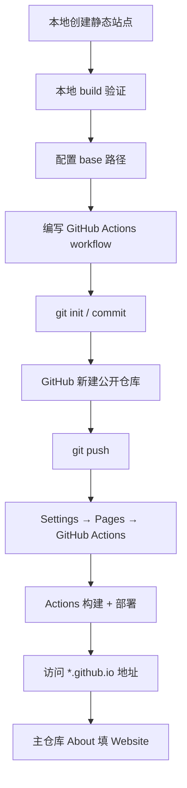

# 在 GitHub 上发布静态网页 — 全流程指南

本文以本仓库 [AssetVault_Website](https://github.com/ladaojeifang/AssetVault_Website) 为例，梳理从「本地写页面」到「公网可访问」的完整流程。适用于开源项目的宣传主页、文档站、单页落地页等**静态站点**。

> **费用**：公开仓库的 GitHub Pages + Actions 对开源项目免费；HTTPS 证书由 GitHub 自动签发。

---

## 一、先想清楚三件事

### 1. 站点放哪里

| 类型 | 仓库命名 | 访问地址示例 |
|------|----------|--------------|
| **项目站**（最常见） | 任意名，如 `AssetVault_Website` | `https://ladaojeifang.github.io/AssetVault_Website/` |
| **用户/组织根站** | `用户名.github.io` 或 `组织名.github.io` | `https://ladaojeifang.github.io/` |
| **自定义域名** | 任意仓库 + DNS CNAME | `https://www.example.com` |

本项目采用**项目站**：代码仓库与主产品仓库（`AssetVault_Pro`）分离，便于独立迭代宣传页。

### 2. 用什么技术写页面

| 方案 | 适合 | 构建 |
|------|------|------|
| 纯 HTML/CSS | 单页、极简 | 无需构建 |
| **Astro**（本项目） | 多页、组件化、性能好 | `pnpm build` → `dist/` |
| VitePress / Docusaurus | 文档站 | 各自 build 命令 |
| Jekyll | GitHub 原生支持 | 可免 Actions，功能较弱 |

静态站点输出目录统一交给 GitHub Pages 托管（本仓库为 `dist/`）。

### 3. 与主仓库的关系

- **宣传站**：独立仓库（本仓库），首页链到 Releases、文档、扩展仓库。
- **产品代码**：仍在 `AssetVault_Pro` 等仓库；About 里的 Website 填宣传站 URL。

---

## 二、全流程总览



---

## 三、本地开发

### 3.1 环境

- Node.js ≥ 18
- pnpm ≥ 9（本项目锁文件为 pnpm 9；本地可用 pnpm 11）

### 3.2 安装与预览

```bash
cd AssetVault_Website
pnpm install
pnpm dev
```

浏览器打开 `http://localhost:4320`（Astro 默认端口以终端输出为准）。

**模拟线上子路径**（项目站必须带仓库名前缀）：

```powershell
# Windows PowerShell
$env:BASE_PATH='/AssetVault_Website/'; pnpm dev
```

```bash
# macOS / Linux
BASE_PATH=/AssetVault_Website/ pnpm dev
```

### 3.3 生产构建

```bash
$env:BASE_PATH='/AssetVault_Website/'   # 与线上一致
$env:SITE_URL='https://ladaojeifang.github.io'
pnpm run build
pnpm preview
```

构建产物在 `dist/`。确认 `dist/index.html`、静态资源路径均以 `/AssetVault_Website/` 为前缀。

### 3.4 Astro 路径配置（关键）

`astro.config.mjs` 通过环境变量控制：

```js
const base = process.env.BASE_PATH ?? '/'
export default defineConfig({
  site: process.env.SITE_URL ?? 'https://ladaojeifang.github.io',
  base,
  output: 'static',
})
```

| 部署场景 | `BASE_PATH` | `SITE_URL` |
|----------|-------------|------------|
| 项目站 `user.github.io/RepoName/` | `/RepoName/` | `https://user.github.io` |
| 根站 `user.github.io` | `/` | `https://user.github.io` |
| 自定义域名 | `/` | `https://your.domain` |

**常见 404 原因**：`BASE_PATH` 与真实 URL 不一致（例如线上是 `/AssetVault_Website/` 却用了 `/`）。

---

## 四、pnpm 11 安装脚本审批（本地）

pnpm 10+ 默认拦截依赖的 `postinstall` 脚本。若出现：

```text
ERR_PNPM_IGNORED_BUILDS  Ignored build scripts: esbuild, sharp
```

在本仓库的 `pnpm-workspace.yaml` 中配置（**必须同时有 `packages` 字段**，否则 CI 也会失败）：

```yaml
packages:
  - .

allowBuilds:
  esbuild: true
  sharp: true
```

或一次性批准：

```bash
pnpm approve-builds --all
```

---

## 五、Git 与首次提交

### 5.1 配置提交身份（首次在本机需做一次）

```bash
git config user.name "你的名字"
git config user.email "你的邮箱"
```

仅当前仓库生效可省略 `--global`。GitHub 上显示头像建议使用已在 GitHub 验证的邮箱。

也可单次提交不写配置：

```bash
git -c user.name="ladao" -c user.email="you@example.com" commit -m "message"
```

### 5.2 初始化并提交

```bash
git init
git add .
git commit -m "Add marketing site (Astro + GitHub Pages)"
```

### 5.3 推送到 GitHub

1. 在 GitHub 网页 **New repository** → 公开仓库 → 名称如 `AssetVault_Website`。
2. **不要**勾选过多模板（若已生成 README，首次 push 需 merge，见下文排错）。
3. 关联远程并推送：

```bash
git remote add origin https://github.com/<用户名>/AssetVault_Website.git
git branch -M main
git push -u origin main
```

若提示 `remote origin already exists`，说明已添加过，直接 `git push` 即可。

---

## 六、GitHub Actions 自动部署

### 6.1 Workflow 文件

路径：`.github/workflows/pages.yml`

职责：

1. **build**：检出代码 → 安装依赖 → `pnpm run build` → 上传 `dist/` 为 Pages 构件。
2. **deploy**：调用 `actions/deploy-pages` 发布到 GitHub Pages。

要点：

```yaml
permissions:
  contents: read
  pages: write
  id-token: write

# build 步骤中传入与线上一致的环境变量
env:
  BASE_PATH: /${{ github.event.repository.name }}/
  SITE_URL: https://${{ github.repository_owner }}.github.io
```

完整文件见本仓库 [`.github/workflows/pages.yml`](../.github/workflows/pages.yml)。

### 6.2 在 GitHub 启用 Pages

1. 打开仓库 **Settings → Pages**。
2. **Build and deployment → Source** 选择 **GitHub Actions**（不是 “Deploy from a branch”）。
3. 保存后，每次 push 到 `main` 会自动触发部署；也可在 **Actions** 页手动 **Run workflow**。

### 6.3 查看部署结果

- **Actions** 标签：工作流 `Deploy GitHub Pages` 应为绿色 ✓。
- 成功后再访问：`https://<用户名>.github.io/<仓库名>/`
- CDN 更新可能有 1～2 分钟延迟，可 Ctrl+F5 强刷。

---

## 七、部署后串联主项目

1. **AssetVault_Pro**、**AssetVault_Browser_Extension** 仓库右侧 **About** → **Website** 填宣传站 URL。
2. 各仓库 README 顶部增加一行，例如：

   ```markdown
   🌐 **官网** · [下载](https://github.com/ladaojeifang/AssetVault_Pro/releases)
   ```

3. （可选）创建 GitHub Organization，用 `组织名/组织名` 仓库的 README 作为组织首页简介。

---

## 八、自定义域名（可选）

1. 在域名 DNS 添加 CNAME 指向 `<用户名>.github.io`。
2. 仓库 **Settings → Pages → Custom domain** 填写域名。
3. 将 `BASE_PATH` 改为 `/`，`SITE_URL` 改为你的域名；重新 push 触发部署。

---

## 九、故障排查

### 9.1 访问 URL 显示 GitHub 404（“There isn't a GitHub Pages site here”）

| 检查项 | 处理 |
|--------|------|
| Actions 是否失败 | 打开 **Actions** 查看红色任务日志 |
| Pages Source 是否为 GitHub Actions | Settings → Pages |
| 是否从未成功 deploy 过 | 至少需一次绿色 workflow |

### 9.2 Actions 在 `setup-node` 失败：`packages field missing or empty`

`pnpm-workspace.yaml` 只有 `allowBuilds` 而没有 `packages` 时会触发。修复：

```yaml
packages:
  - .
allowBuilds:
  esbuild: true
  sharp: true
```

### 9.3 页面能打开但样式/图片全丢

`BASE_PATH` 配置错误。项目站必须是 `/仓库名/`（首尾斜杠按 Astro 要求），与浏览器地址栏路径一致。

### 9.4 `git push` 被拒绝（remote 有 Initial commit）

远程创建仓库时带了 README，需先合并：

```bash
git pull origin main --allow-unrelated-histories
# 解决 README 冲突后
git push
```

### 9.5 `Author identity unknown`

见 [5.1 配置提交身份](#51-配置提交身份首次在本机需做一次)。

---

## 十、本仓库检查清单

上线前逐项确认：

- [ ] 本地 `BASE_PATH=/AssetVault_Website/ pnpm run build` 成功
- [ ] `pnpm-workspace.yaml` 含 `packages: ['.']` 与 `allowBuilds`
- [ ] `.github/workflows/pages.yml` 已提交
- [ ] GitHub **Settings → Pages → Source = GitHub Actions**
- [ ] Actions 最近一次 run 为 **success**
- [ ] 浏览器可打开 `https://ladaojeifang.github.io/AssetVault_Website/`
- [ ] 中英文切换 `/` 与 `/en/` 正常
- [ ] 主产品仓库 About 已填 Website

---

## 十一、相关链接

| 资源 | URL |
|------|-----|
| 本仓库 | https://github.com/ladaojeifang/AssetVault_Website |
| 线上站点 | https://ladaojeifang.github.io/AssetVault_Website/ |
| GitHub Pages 文档 | https://docs.github.com/en/pages |
| Astro 部署文档 | https://docs.astro.build/en/guides/deploy/github/ |
| AssetVault Pro | https://github.com/ladaojeifang/AssetVault_Pro |
| 浏览器扩展 | https://github.com/ladaojeifang/AssetVault_Browser_Extension |

---

## 十二、命令速查

```bash
# 本地开发
pnpm install && pnpm dev

# 本地模拟线上路径构建
BASE_PATH=/AssetVault_Website/ SITE_URL=https://ladaojeifang.github.io pnpm run build

# 首次推送
git init && git add . && git commit -m "Initial site"
git remote add origin https://github.com/<user>/<repo>.git
git push -u origin main

# 推送后
# → GitHub Settings → Pages → GitHub Actions
# → 等待 Actions 绿勾 → 打开 https://<user>.github.io/<repo>/
```
